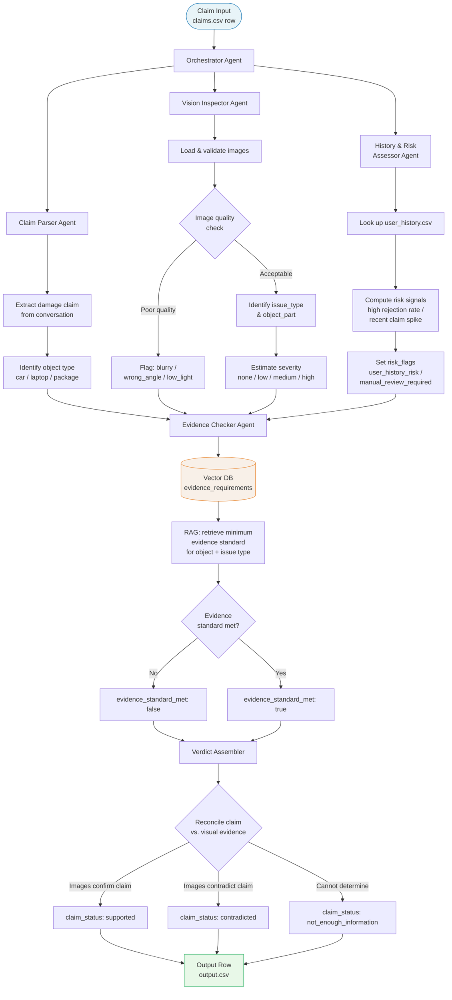

# Multimodal Insurance Claims Verification System

> An agentic AI pipeline that verifies damage insurance claims using images, conversation context, and user history — combining vision models, RAG, and multi-agent orchestration to deliver structured, grounded claim verdicts.

---

## 📌 The Problem

Insurance claim processing is slow, expensive, and fraud-prone. Today, most insurers rely on:

- **Manual adjuster reviews** that take days and cost significant overhead
- **Text-only forms** that let users describe damage without visual verification
- **No cross-referencing** between what a user says, what photos show, and their claim history

This creates two expensive failure modes: **legitimate claims get delayed** because they wait in a queue, and **fraudulent claims slip through** because no system is cross-referencing the three sources of truth together.

The core gap: there is no system that looks at the image, reads the conversation, checks the user's history, and produces a structured, explainable verdict automatically.

---

## 💡 The Solution

This system acts as an **automated first-pass claims reviewer**. For every incoming claim, it:

1. Extracts what the user is actually claiming from their conversation
2. Inspects submitted images using a vision model to identify damage type, affected part, and image quality
3. Reconciles the claim text against visual evidence to produce a verdict: `supported`, `contradicted`, or `not_enough_information`
4. Layers in user history to surface risk signals without overriding clear visual evidence
5. Checks whether submitted images meet the minimum evidence standard for that claim type
6. Returns a fully structured, auditable output row per claim

The system handles three object types: **car**, **laptop**, and **package** — each with domain-specific damage taxonomy and evidence requirements.

---

## 🏗️ Architecture Overview

The pipeline is built around four specialized agents orchestrated by a central coordinator:

```
┌─────────────────────────────────────────────────────────────────┐
│                      Claims Ingestion Layer                      │
│          (CSV / API input with image paths + metadata)           │
└─────────────────────────────┬───────────────────────────────────┘
                              │
                              ▼
┌─────────────────────────────────────────────────────────────────┐
│                    Orchestrator Agent                            │
│         Routes each claim through the full pipeline             │
│         Manages retries, batching, and output assembly          │
└────┬─────────────────┬─────────────────┬────────────────────────┘
     │                 │                 │
     ▼                 ▼                 ▼
┌─────────┐     ┌──────────────┐    ┌────────────────────┐
│  Claim  │     │    Vision    │    │   History &        │
│  Parser │     │   Inspector  │    │   Risk Assessor    │
│  Agent  │     │    Agent     │    │      Agent         │
└────┬────┘     └──────┬───────┘    └─────────┬──────────┘
     │                 │                      │
     └────────┬────────┘                      │
              ▼                               │
┌─────────────────────────────┐              │
│    Evidence Checker Agent    │◄─────────────┘
│  (RAG over requirements DB)  │
└─────────────┬───────────────┘
              │
              ▼
┌─────────────────────────────────────────────────────────────────┐
│                       Verdict Assembler                          │
│   Merges all signals → structured output row (14 columns)       │
└─────────────────────────────────────────────────────────────────┘
```

---

## 🔄 End-to-End Workflow



---

## 🧩 Agent Responsibilities

| Agent | Inputs | Outputs |
|---|---|---|
| **Claim Parser** | `user_claim` transcript | Extracted damage description, object type |
| **Vision Inspector** | Image files | `issue_type`, `object_part`, `severity`, image risk flags, `supporting_image_ids` |
| **History & Risk Assessor** | `user_id` → `user_history.csv` | `risk_flags` related to user behaviour |
| **Evidence Checker** | Object type + issue type → vector DB | `evidence_standard_met`, `evidence_standard_met_reason` |
| **Verdict Assembler** | All agent outputs | Final 14-column structured row |

---

## 🛠️ Tech Stack

| Layer | Technology |
|---|---|
| **Agent Orchestration** | LangChain / LangGraph |
| **Vision Model** | Claude claude-sonnet-4-6 (multimodal) via Anthropic API |
| **LLM (text reasoning)** | Claude claude-sonnet-4-6 |
| **RAG / Vector DB** | ChromaDB + sentence-transformers |
| **Embeddings** | `all-MiniLM-L6-v2` |
| **Backend API** | FastAPI |
| **Data Processing** | Pandas |
| **Containerization** | Docker + Docker Compose |
| **Structured Output** | Pydantic models + JSON schema enforcement |
| **Evaluation** | Custom Python eval harness (accuracy per output field) |

---

## 📂 Project Structure

```
insurance-claims-verifier/
│
├── agents/
│   ├── claim_parser.py          # Extracts damage claim from conversation
│   ├── vision_inspector.py      # Multimodal image analysis agent
│   ├── risk_assessor.py         # User history risk signal extraction
│   ├── evidence_checker.py      # RAG-based evidence standard lookup
│   └── orchestrator.py          # Pipeline coordinator
│
├── rag/
│   ├── ingest.py                # Embeds evidence_requirements into ChromaDB
│   ├── retriever.py             # Retrieves relevant evidence standards
│   └── vector_store/            # Persisted ChromaDB collection
│
├── api/
│   ├── main.py                  # FastAPI application
│   ├── schemas.py               # Pydantic models for input/output
│   └── routes/
│       ├── claims.py            # POST /claims/verify
│       └── health.py            # GET /health
│
├── data/
│   ├── claims.csv               # Test input
│   ├── sample_claims.csv        # Labeled dev set
│   ├── user_history.csv
│   ├── evidence_requirements.csv
│   └── images/
│
├── evaluation/
│   ├── evaluator.py             # Field-level accuracy evaluation
│   └── evaluation_report.md     # Cost, latency, token usage analysis
│
├── docker/
│   ├── Dockerfile
│   └── docker-compose.yml       # App + ChromaDB services
│
├── prompts/
│   ├── claim_parser_prompt.txt
│   ├── vision_inspector_prompt.txt
│   └── verdict_assembler_prompt.txt
│
├── output.csv                   # Final predictions
├── requirements.txt
└── README.md
```

---

## 🚀 Getting Started

```bash
# Clone the repository
git clone https://github.com/shreyapatro/insurance-claims-verifier.git
cd insurance-claims-verifier

# Start all services with Docker
docker-compose up --build

# Run on the test set
python pipeline/run.py --input data/claims.csv --output output.csv

# Evaluate against labeled sample
python evaluation/evaluator.py --predictions output.csv --labels data/sample_claims.csv
```

---

## 📊 Output Schema

Each processed claim produces a row with 14 columns:

| Column | Description | Allowed Values |
|---|---|---|
| `evidence_standard_met` | Whether images meet minimum review bar | `true` / `false` |
| `risk_flags` | Semicolon-separated risk signals | `blurry_image`, `wrong_object`, `user_history_risk`, ... |
| `issue_type` | Detected damage type | `dent`, `crack`, `torn_packaging`, `water_damage`, ... |
| `object_part` | Affected part | `windshield`, `screen`, `package_corner`, ... |
| `claim_status` | Final verdict | `supported`, `contradicted`, `not_enough_information` |
| `severity` | Damage severity estimate | `none`, `low`, `medium`, `high`, `unknown` |
| `supporting_image_ids` | Which images informed the decision | e.g., `img_1;img_3` |

---

## 🔑 Key Design Decisions

**Images are the source of truth.** User history can flag risk but cannot flip a verdict that is clearly supported or contradicted by visual evidence.

**RAG for evidence standards.** Evidence requirements are embedded into ChromaDB so the Evidence Checker can retrieve the relevant minimum bar dynamically by object type and issue family — no hardcoded conditionals.

**Structured output enforcement.** All LLM calls use Pydantic schema validation and JSON mode to prevent enum drift and ensure the output always matches the required column types.

**Batching and caching.** Images are hashed before submission; duplicate images across claims skip re-processing. Claims are batched in groups of 5 to stay within API rate limits.

---

## 🗺️ Roadmap

- [ ] Core pipeline (all 4 agents + orchestrator)
- [ ] FastAPI wrapper with `/claims/verify` endpoint
- [ ] ChromaDB RAG setup for evidence requirements
- [ ] Docker Compose multi-service setup
- [ ] Evaluation harness against sample labels
- [ ] Streamlit dashboard for visual claim review
- [ ] Fraud pattern clustering across historical claims
- [ ] Support for video evidence (short clips)

---

## 👩‍💻 Author

**Shreya Patro** · B.Tech Computer Science (Minor: Financial Economics) · KIIT University  
[GitHub](https://github.com/shreyapatro) · [LinkedIn](https://linkedin.com/in/shreya-patro)
